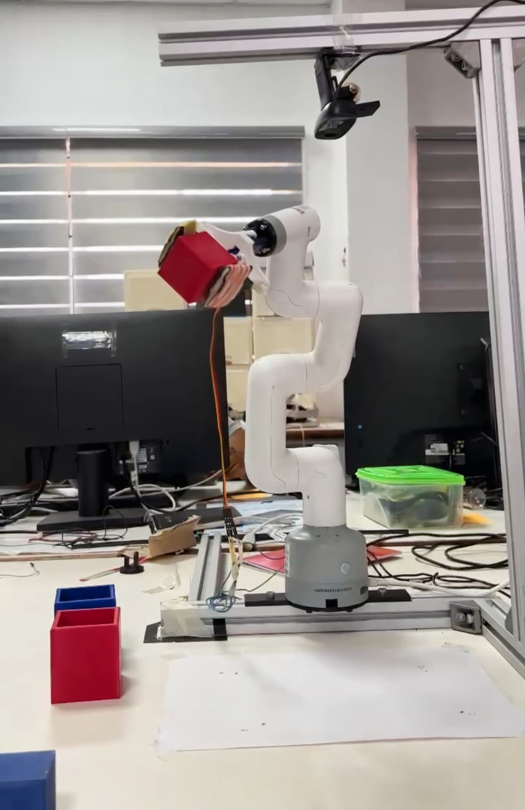
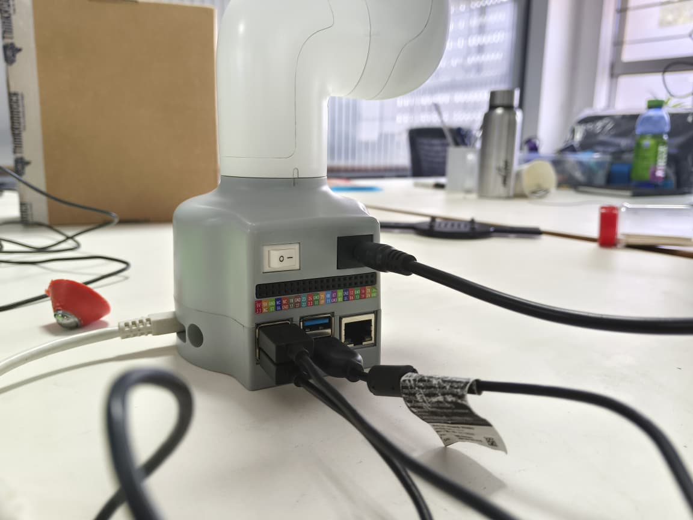
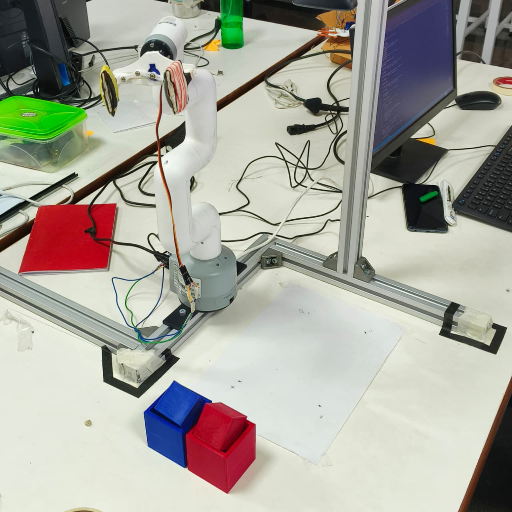
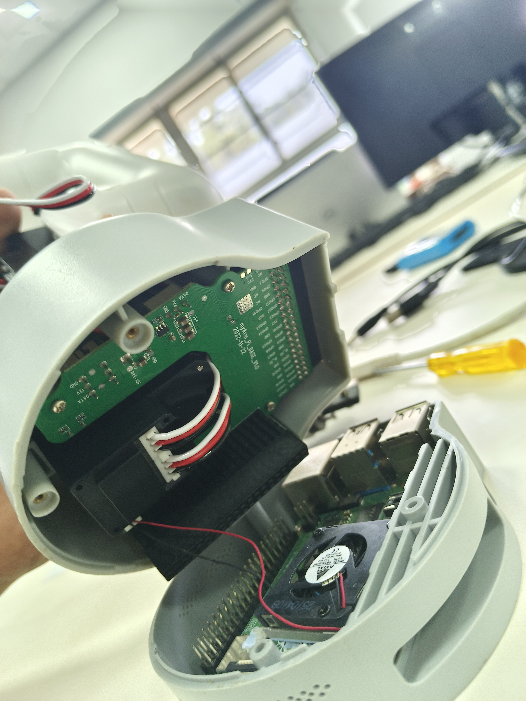
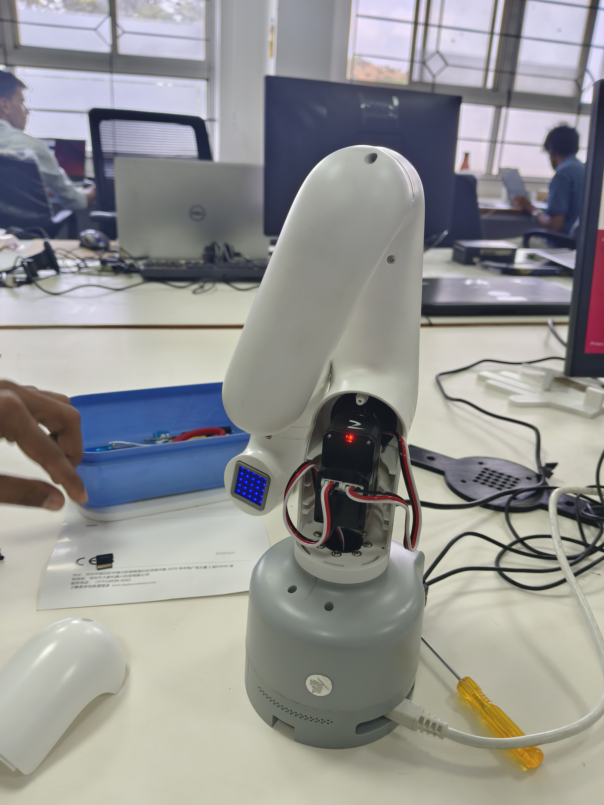
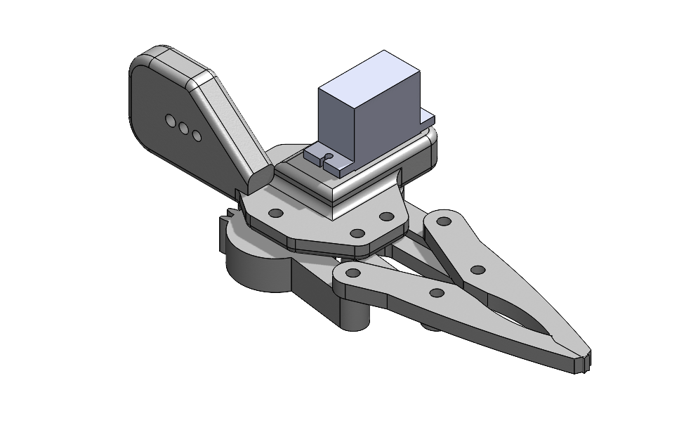
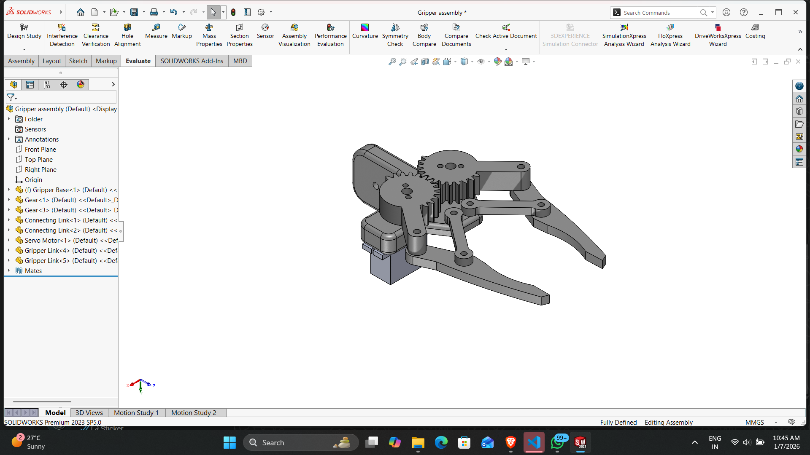
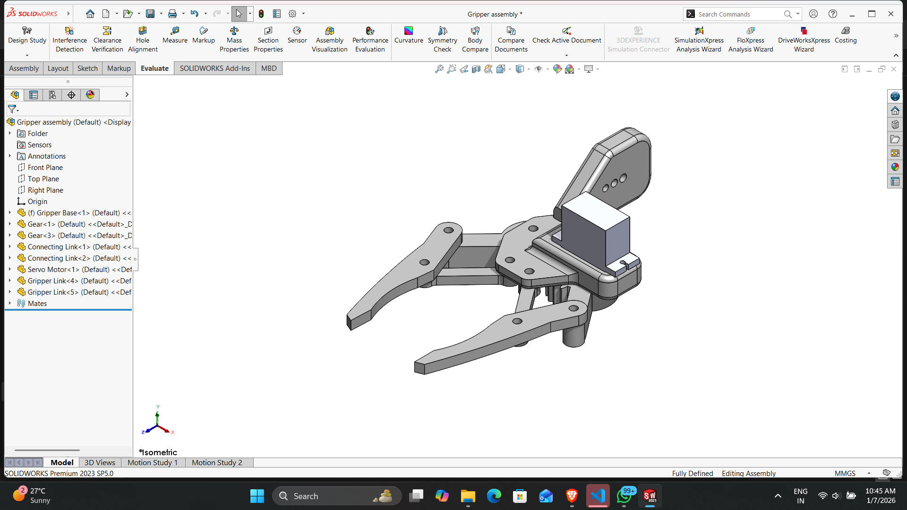

# 🤖 Pick and Place Automation Using Cobot Arm with Vision-Based Color Detection

## 📌 Overview
This project demonstrates a **vision-based pick-and-place automation system** using the **Cobot Arm 280**.  
The system uses a camera and computer vision techniques to detect colored objects and automatically place them into their corresponding baskets.

The project integrates **robotics, computer vision, and automation** to create an intelligent object sorting system.

---

# 🎯 Project Aim
Develop an automated system where the cobot arm can:

- Detect objects based on color
- Pick them using a gripper mechanism
- Place them accurately into corresponding color baskets

---

# 🧠 Technologies Used

- Python
- OpenCV
- pymycobot Library
- Cobot Arm 280
- Camera Module

---

# ⚙️ Installation

Install the required Python library:

```bash
pip install pymycobot --upgrade
```

---

# 📂 Project Structure

```
PROJECT_UPDATE
│
├── Codes
│   ├── hand_gesture_receiver.py
│   ├── Hand_gesture_sender.py
│   ├── initial.py
│   ├── multiple.py
│   ├── Pick_and_Place.py
│   └── servo.py
│
├── Images
│   ├── Cobot_280pi.jpeg
│   ├── Connections.jpeg
│   ├── Gripper.png
│   ├── Gripper_1.png
│   ├── Gripper_2.png
│   ├── Inside_cobot.jpg
│   ├── Inside_cobot_1.jpg
│   ├── Motors.jpg
│   └── Workspace.jpeg
│
├── Videos
│   ├── Blockly.mov
│   ├── Gesture control.mp4
│   ├── Pick an Place.mp4
│   └── Teach and Playback.mp4
│
└── README.md
```

---

# 🦾 Cobot Arm



The **Cobot 280 Pi** is a 6-DOF collaborative robotic arm used for robotics research and automation.

---

# 🔌 Hardware Connections



This image shows the hardware connections of the cobot arm including power, controller, and communication setup.

---

# 🧰 Workspace Setup



The workspace contains colored objects that the robot detects and sorts into the correct baskets.

---

# 🔩 Internal Components





The robotic arm contains multiple servo motors and internal control electronics that allow precise motion control.

---

# ✋ Gripper Mechanism







The gripper is controlled using a **servo motor with PWM signals** to open and close for object gripping.

Rubber padding is used to increase friction and prevent objects from slipping.

---

# 🎥 Project Demonstrations

## 🎥 Pick and Place Demo


Full video:  
[▶ Watch Full Video](Videos/Pick_and_Place.mp4)

---

## 🎥 Gesture Control Demo


Full video:  
[▶ Watch Full Video](Videos/Gesture_control.mp4)

---

## 🎥 Teach and Playback Demo


Full video:  
[▶ Watch Full Video](Videos/Teach_and_Playback.mp4)

---

## 🎥 Blockly Programming Demo


Full video:  
[▶ Watch Full Video](Videos/Blockly.mov)

---

# 🔄 System Workflow

```
Camera Capture
      ↓
Color Detection (OpenCV)
      ↓
Object Localization
      ↓
Pick Command
      ↓
Gripper Actuation
      ↓
Place Command
```

---

# 🚀 Features

- Vision-based color detection
- Autonomous pick and place
- Gesture-based control
- Teach and playback functionality
- Smooth robotic motion

---

# 📈 Future Scope

- Shape-based object sorting
- AI-based object detection
- Conveyor belt integration
- ROS-based automation
- Multi-object detection

---

# 👨‍💻 Author

**Nishith K**  
Robotics Student | Autonomous Systems Enthusiast  

GitHub:  
https://github.com/nishith982